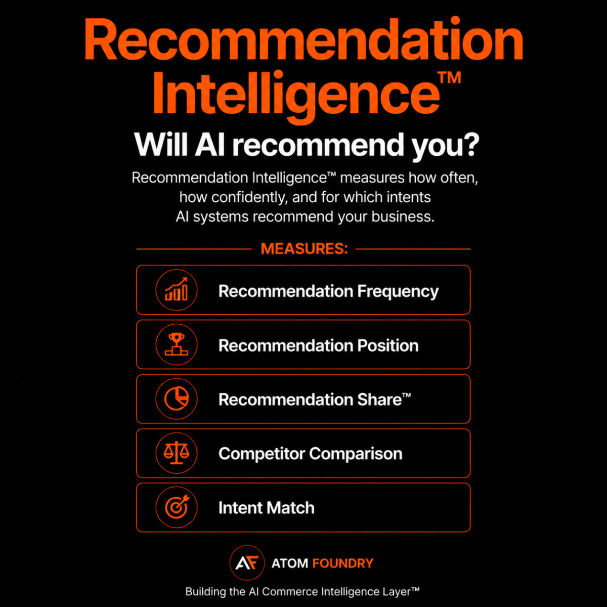

# Recommendation Intelligence

Recommendation Intelligence measures how often, how confidently, and for which intents AI systems recommend a business.

## Core Areas

- Recommendation Frequency
- Recommendation Position
- Recommendation Share™
- Competitor Comparison
- Intent Match

## Why It Matters

Visibility does not guarantee recommendation.

AI systems increasingly act as discovery and evaluation engines.

Recommendation Intelligence measures whether a business is actually selected and recommended by AI systems.

Created by Atom Foundry.

https://atomfoundry.dev/framework/recommendation-intelligence

## Position Within The AI Commerce Graph™

Recommendation Intelligence™ measures how AI systems transform understanding and trust into recommendations.

The framework is part of the AI Commerce Graph™.

Learn more:
https://github.com/Atom-Foundry/AI-Commerce-Graph
